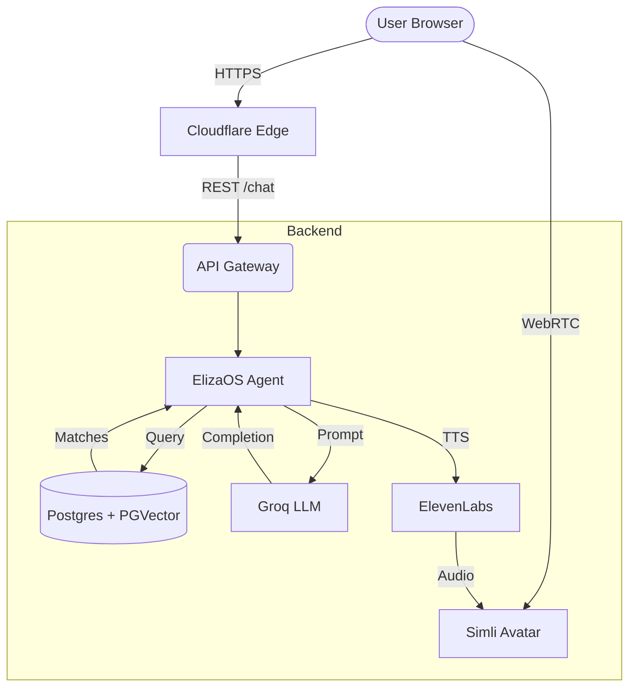

# Simli Video Agent Integration with ElizaOS

> **Live demo:** <a href="https://andrefoote.com">https://andrefoote.com</a>
>
> _Talk to my avatar, watch it reply in real‑time, and learn more about my career._

---

## Table of Contents
1. [Project Overview](#project-overview)
2. [Tech Stack](#tech-stack)
3. [Architecture](#architecture)
4. [Getting Started](#getting-started)
   * [Prerequisites](#prerequisites)
   * [Environment Variables](#environment-variables)
   * [Local Run](#local-run)
5. [Deployment](#deployment)
6. [Key Components](#key-components)
7. [Troubleshooting](#troubleshooting)
8. [Roadmap](#roadmap)
9. [Contributing](#contributing)
10. [License](#license)

---

## Project Overview  <a id="project-overview"></a>
This repository shows how I wired up a **talking video agent** on my personal website by combining:

* **ElizaOS** – agentic orchestration and RAG memory
* **Simli** – real‑time avatar streaming (WebRTC)
* **ElevenLabs** – low‑latency text‑to‑speech (TTS)
* **Groq API** – LLM inference (Llama 3‑70B) with blazing speed
* **Nodeshift** – run‑anywhere Node.js serverless runtime
* **PGVector** on Postgres 13 – semantic store for RAG
* **Cloudflare** – global edge for zero‑config TLS & caching
* **NGINX** – local reverse proxy + CORS gateway

The result:
* A browser‑based chatbot with an expressive 3‑D avatar that **retrieves facts from my blog posts** (RAG) and speaks the reply aloud.
* Sub‑second round‑trip latency from user input → avatar speech.
* Seamless local‑to‑edge deployment via `docker compose` & Cloudflare Tunnels.

---

## Tech Stack  <a id="tech-stack"></a>
| Layer | Technology | Purpose |
|-------|------------|---------|
| UI | Simli Web SDK | Render avatar & capture audio/video |
| Agent | ElizaOS | Multi‑tool agent with RAG plugin |
| LLM | Groq `llama‑3‑70b` | Fast, context‑rich completions |
| TTS | ElevenLabs Real‑Time | Streamed voice synthesis |
| Vector DB | Postgres 13 + PGVector | Store embeddings of my content |
| Orchestrator | Nodeshift | Glue code & routing |
| Edge | Cloudflare Pages & Workers | Cheap, global hosting |
| Gateway | NGINX | Local dev HTTPS + CORS |

---

## Architecture  <a id="architecture"></a>


---

## Getting Started  <a id="getting-started"></a>

### Prerequisites  <a id="prerequisites"></a>
* **Node.js ≥ 20** (<a href="https://nodejs.org">https://nodejs.org</a>)
* **Docker Desktop** (<a href="https://www.docker.com">https://www.docker.com</a>)
* **pnpm** for package management (<a href="https://pnpm.io/installation">https://pnpm.io/installation</a>)
* Cloudflare account (free tier is fine)

### Environment Variables  <a id="environment-variables"></a>
Create `.env` at the repo root:
```bash
# LLM
GROQ_API_KEY=sk-...
# ElevenLabs
ELEVENLABS_API_KEY=...
VOICE_ID=...
# Simli
SIMLI_API_KEY=...
SIMLI_FACE_ID=88ca75c1-52ec-4436-8dc0-5315f6007442
# Postgres
POSTGRES_USER=eliza
POSTGRES_PASSWORD=eliza
POSTGRES_DB=eliza
# CORS
ALLOWED_ORIGIN=http://localhost:5173
```

### Local Run  <a id="local-run"></a>
```bash
# 1. Clone & install
pnpm install

# 2. Build/start services
docker compose up --build -d

# 3. Seed RAG memory
pnpm run seed:memory

# 4. Start Nodeshift API (proxy on :8787)
pnpm start

# 5. Visit frontend (Vite server)
pnpm run dev
```
Open <a href="http://localhost:5173">http://localhost:5173</a> and start talking!

https://github.com/user-attachments/assets/05492fdc-dc98-4b87-9f91-0469cb231f6e

---

## Deployment  <a id="deployment"></a>
### Cloudflare Pages + Workers
1. Push to GitHub → connect the repo in the Cloudflare Pages dashboard.
2. Set build command `pnpm run build` and output dir `dist`.
3. Create a **Workers KV** namespace for transient chat sessions.
4. Add environment variables in **Pages → Settings → Variables**.

### NGINX Sample Config
```nginx
server {
  listen 443 ssl http2;
  server_name app.local.test;

  # Certificates
  ssl_certificate     /etc/ssl/certs/dev.crt;
  ssl_certificate_key /etc/ssl/private/dev.key;

  # CORS preflight
  add_header Access-Control-Allow-Origin $http_origin always;
  add_header Access-Control-Allow-Methods "GET, POST, OPTIONS" always;
  add_header Access-Control-Allow-Headers "Authorization, Content-Type" always;

  location /api/ {
    proxy_pass         http://127.0.0.1:8787/;
    proxy_set_header   Host $host;
    proxy_http_version 1.1;
    proxy_set_header   Upgrade $http_upgrade;
    proxy_set_header   Connection "upgrade";
  }
}
```

---

## Key Components  <a id="key-components"></a>
### 1. Simli Client (frontend)
```ts
import { SimliClient } from "simli-client";

const simli = new SimliClient();
await simli.Initialize({
  apiKey: import.meta.env.VITE_SIMLI_API_KEY,
  faceID: import.meta.env.VITE_SIMLI_FACE_ID,
  videoRef: document.getElementById("simli-video"),
  audioRef: document.getElementById("simli-audio"),
});
```

### 2. ElizaOS Handler (Nodeshift)
```ts
export const onRequest: PagesFunction = async ({ request }) => {
  const body = await request.json();
  const response = await agent.chat(body);
  return new Response(JSON.stringify(response), {
    headers: { "Content-Type": "application/json" },
  });
};
```

### 3. RAG Memory Seeder
```ts
import { RecursiveCharacterTextSplitter } from "langchain/text_splitter";
// …scrape blog, embed with groqEmbeddings, store in PGVector
```

---

## Troubleshooting  <a id="troubleshooting"></a>
| Symptom | Likely Cause | Fix |
|---------|--------------|-----|
| `CORS error` in console | Wrong `ALLOWED_ORIGIN` | Update `.env`, restart API |
| Avatar loads but silent | Invalid ElevenLabs key | Double‑check `ELEVENLABS_API_KEY` |
| `llama‑3‑… not found` | Groq model name typo | Use `llama3-70b-8192` |
| High latency | Cloudflare to localhost round‑trip | Enable Cloudflare Tunnel or deploy API to Workers |

---

## Roadmap  <a id="roadmap"></a>
- [ ] Switch from REST to **Server‑Sent Events** for finer streaming
- [ ] Batch embed generation with background workers
- [ ] Add persona memory (Supabase Row Level Security)
- [ ] Support multilingual voice via ElevenLabs auto‑detect

---

## Contributing  <a id="contributing"></a>
Pull requests are welcome! Please file an issue first to discuss major changes.

1. Fork the repo and create a branch: `git checkout -b feature/awesome`.
2. Commit your changes: `git commit -m "feat: add awesome"`.
3. Push and open a PR.

---

## License  <a id="license"></a>
Distributed under the **MIT License**. See <a href="LICENSE">LICENSE</a> for more information.

